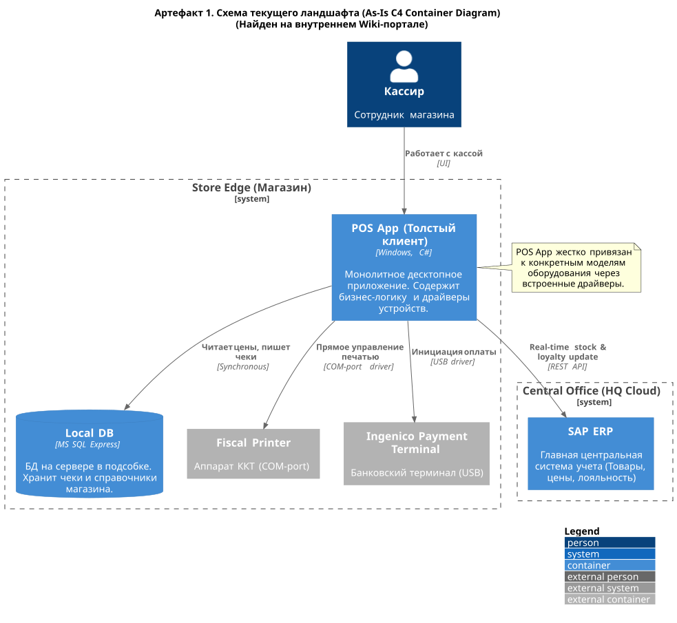

# Кейс компании VitaStore

Вам предстоит решить типовую для многих компаний задачу — оптимизировать операционные затраты сети магазинов **VitaStore** по двум направлениям:

1. **Автоматизация процессов** для снижения затрат на персонал.
2. **Аудит внутренних решений** с высокой стоимостью владения и оценка возможности их замены на готовые облачные сервисы.

---

## О компании

Федеральная розничная сеть категории *дрогери* **VitaStore** растёт за счёт агрессивного поглощения региональных конкурентов (M&A). Однако рост стал убыточным из-за чрезмерных операционных расходов.

### Cost Drivers:

* **Высокие затраты на персонал при интеграции:** чтобы подключить один купленный магазин, нужно отправить ИТ-бригаду (командировочные, ФОТ) для настройки локальных серверов и завести в систему новую номенклатуру — менеджеры будут вручную сопоставлять Excel-таблицы до двух недель.
* **Критический TCO инфраструктуры:** каждый из более 500 магазинов имеет собственный локальный сервер и платные лицензии на ПО (Windows Server, SQL), которые нужно обновлять и администрировать.
* **Проблемы с оборудованием:** для разнородных платёжных терминалов в магазинах купленных сетей нужны уникальные драйверы, а это блокирует внедрение единых стандартов.

Руководство сети хочет разработать архитектуру, которая:

* **Снизит TCO** магазина на **40%** за счёт перехода в облако;
* **Сократит трудозатраты** на открытие новой точки с **двух недель до пяти дней**.

---

## Структура компании

* **Центральный офис (HQ):** департамент развития (M&A), коммерческий департамент (управление ассортиментом), ИТ-дирекция.
* **Розничная сеть:** 500 собственных магазинов и постоянный поток новых (купленных) точек с разнородными процессами.

### Команды и продукты, с которыми работаем в рамках кейса

* **Team Store Ops:** отвечает за бесперебойную работу программного обеспечения в магазинах (кассы, товарный учёт). Сейчас они перегружены поддержкой легаси.
* **Team Data Integration:** занимается слиянием баз данных при покупке новых сетей. Сейчас это ручной конвейер.

### Развёрнутые технологии, сервисы и приложения

#### В магазине:

* «Толстый клиент» кассы и back-office на базе десктопного ПО.
* Локальная база данных (MS SQL Server / PostgreSQL) на ПК в магазине.
* Разнородный парк банковских терминалов с прямой интеграцией в кассовый софт (жёсткая связка), контракты с поставщиком услуг/кассового аппарата.

#### В центральном офисе:

* Мощная on-premise SAP ERP (учёт товаров, кадров, финансов).
* Единый движок промоакций (Promo Engine).
* Собственная система омниканальной логистики (Smart Fulfillment).

---

## Артефакты

Во время первичного (*Discovery*) обследования компании VitaStore аналитики собрали «сырые» артефакты: обрывки регламентов, старые схемы и выгрузки из Service Desk.

> **Важно:** Как и в любом реальном enterprise-проекте, абсолютная достоверность, актуальность и внутренняя непротиворечивость этих данных не гарантированы.

### Артефакт 1. Схема текущего ландшафта (As-Is C4 Container Diagram)

*Эта схема была найдена на внутреннем Вики-портале компании: [vita_store_as_is_artefact.puml](vita_store_as_is_artefact.puml).*

> **Комментарий для ревьюера:** На схеме указана интеграция кассы с SAP по REST API в реальном времени. Однако никакого Real-time нет: есть ночной обмен файлами и ручной труд, что можно заметить на артефактах 2 и 3.

---

### Артефакт 2. Выдержка из регламента «Интеграция новой торговой точки»

* **Статус документа:** Действующий
* **Владелец:** Департамент M&A и IT-дирекция

#### Процедура переноса номенклатуры (Этапы 4–7):

* **4.1.** Выездной ИТ-инженер по прибытии в новый магазин сети подключается к старой кассе (Front-office) и снимает дамп базы товаров в формате `.csv` или `.xls`.
* **4.2.** Инженер отправляет файл на email `data-integration@vitastore.ru`.
* **5.1.** Товаровед (HQ) открывает файл и запускает макрос `VLOOKUP` по штрихкодам с базой SAP ERP.
* **5.2.** Позиции без штрихкодов или с несовпадающими названиями *(пример: «Шамп. Head&Shoulders 400» в старой базе и «Шампунь H&S 400мл Основной уход» в базе VitaStore)* товаровед обрабатывает вручную. **Норматив обработки:** 500 позиций в час на одного сотрудника.
* **6.1.** После сведения таблицы товаровед загружает итоговый файл в SAP ERP.
* **7.1.** SAP ERP формирует пакет обновлений (`XML`) и в 02:00 ночи по FTP рассылает обновлённые прайс-листы на локальные серверы (`Local DB`) всех магазинов, включая новый.

---

### Артефакт 3. Выгрузка тикетов из Jira (Service Desk) от Team Store Ops

* **`INC-8402`:** Магазин №112. Интернет отвалился из-за обрыва кабеля провайдера. Касса работает офлайн, чеки бьются, но мы не можем применять карты лояльности. Покупатели просят списать/накопить баллы, но касса выдаёт ошибку по тайм-ауту. Пришлось повесить табличку «Только наличные, без карт лояльности». Часть покупателей отказалась от покупок.
* **`INC-8415`:** Срыв сроков открытия магазина №205. В купленной сети стоят терминалы Сбера. Наш кассовый клиент не умеет работать с их протоколом ARCUS-2. Команда разработки оценивает написание нового драйвера и пересборку кассового приложения в 3 недели.
* **`INC-8433`:** Предположительно «умер» жёсткий диск на сервере в подсобке магазина №45. Магазин встал. ИТ-инженер выехал с новым системным блоком, ETA 4–6 часов.

---

### Артефакт 4. Расшифровка интервью (Discovery Phase)

* **Респондент:** Ведущий категоричный менеджер (команда Data Integration)
* **Тема:** Проблемы маппинга товаров

> «Слушайте, этот маппинг — просто ад. Мы скупаем по десять магазинов в месяц. У каждого своя база, заведённая местными продавцами как бог на душу положит. Иногда вместо названия написано "Крем д/рук синий".
> Мы пробовали писать SQL-скрипты для нечёткого поиска (*fuzzy string matching*), но они дают кучу ложных срабатываний. Если скрипт ошибётся и привяжет к дорогому крему дешёвый штрихкод, мы продадим крем в минус. Поэтому почти 80% ассортимента просматриваем вручную. К концу дня рябит в глазах.
> Руководство требует сократить срок интеграции с двух недель до пяти дней. Я не знаю как, разве что клонировать мой отдел.»

---

## Цели бизнеса

### Промежуточное состояние (через пару месяцев)

* Проведён аудит текущих решений и выбран стек облачных сервисов (SaaS/PaaS) для замены локальных серверов.
* Разработан автоматизированный процесс (To-Be) миграции данных нового магазина (SKU Matching) с минимальным участием человека.
* Подготовлен расчёт TCO, обосновывающий отказ от локального «железа».

### Финальное состояние (через год)

* **Полный переход на Cloud POS (тонкий клиент):** в магазине остаётся только планшет и фискальный регистратор. Локальные серверы ликвидированы.
* **Снижение затрат** на ИТ-поддержку региональной сети на **40%**.
* **Автоматическая адаптация** под любые платёжные системы и терминалы через Payment Gateway.
